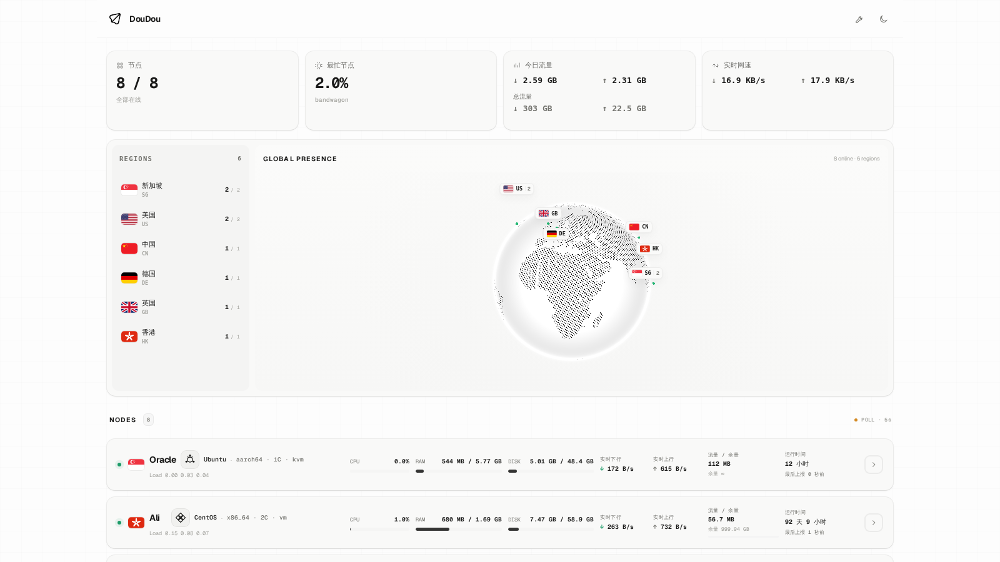

# Atlas for Monitor

Atlas 是为 [Monitor](https://github.com/monitor-probe/monitor) 制作的独立第三方主题，v1.0.0 起作为稳定版本维护。

当前版本：**v1.3.18**

## 主题简介

简洁的 Atlas 风格状态面板，提供地球分布总览、节点状态、流量统计与三网延迟历史图表。

## 主要功能

- 节点状态、CPU / RAM / DISK、实时上下行与首页三网延迟
- 今日 / 累计流量、本周期流量与剩余额度
- 联通 / 电信 / 移动延迟、平均值与丢包
- 1H / 6H / 24H / 7D 历史图表与移动端触摸查看
- COBE 点阵地球与地区标签
- 桌面端详情 Drawer、手机端全屏详情
- 桌面端列表 / 卡片双视图，手机端紧凑资源卡片

## 安装与更新

在 Monitor 后台上传 GitHub Release 中的 `theme.tar.gz` 即可安装。

Monitor支持后台在线检查并更新本主题。

## 上游项目

- Monitor：https://github.com/monitor-probe/monitor
- 官方默认主题：https://github.com/monitor-probe/monitor-theme-default

## 第三方资源

纸飞机图标来自 [Flaticon UIcons](https://www.flaticon.com/free-icon-font/paper-plane_3917567)。
